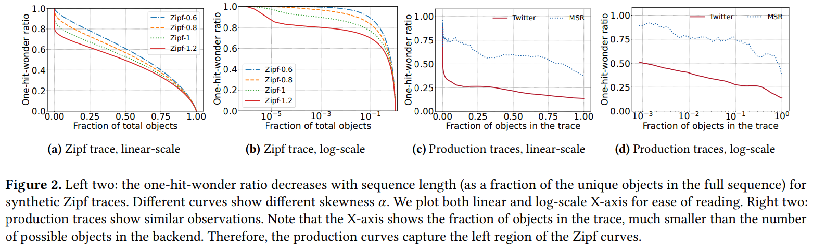
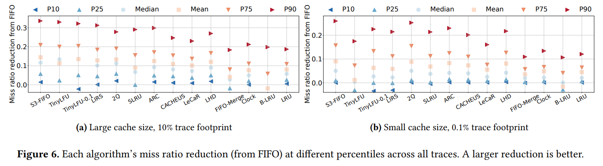

<h1 align="center">golang-fifo</h1>
<p align="center">
    <a href="https://opensource.org/licenses/MIT"></a>
</p>

This is a modern cache implementation, **inspired** by the following papers, provides high efficiency.

- **SIEVE** | [SIEVE is Simpler than LRU: an Efficient Turn-Key Eviction Algorithm for Web Caches](https://junchengyang.com/publication/nsdi24-SIEVE.pdf) (NSDI'24)
- **S3-FIFO** | [FIFO queues are all you need for cache eviction](https://dl.acm.org/doi/10.1145/3600006.3613147) (SOSP'23)

This offers state-of-the-art efficiency and scalability compared to other LRU-based cache algorithms.

## Basic Usage
```go
import "github.com/scalalang2/golang-fifo/sieve"

size := 1e5
cache := sieve.New[string, string](size)

cache.Set("hello", "world")
val, _ := cache.Get("hello") 
fmt.Printf("value: %s", val) // => "world"
```

## Benchmark Result
The benchmark result were obtained using [go-cache-benchmark](https://github.com/scalalang2/go-cache-benchmark)

```
itemSize=500000, workloads=7500000, cacheSize=0.10%, zipf's alpha=0.99, concurrency=16

      CACHE      | HITRATE | MEMORY  |   QPS   |  HITS   | MISSES
-----------------+---------+---------+---------+---------+----------
  sieve          | 47.66%  | 0.09MiB | 2508361 | 3574212 | 3925788
  tinylfu        | 47.37%  | 0.11MiB | 2269542 | 3552921 | 3947079
  s3-fifo        | 47.17%  | 0.18MiB | 1651619 | 3538121 | 3961879
  slru           | 46.49%  | 0.11MiB | 2201350 | 3486476 | 4013524
  s4lru          | 46.09%  | 0.12MiB | 2484266 | 3456682 | 4043318
  two-queue      | 45.49%  | 0.17MiB | 1713502 | 3411800 | 4088200
  clock          | 37.34%  | 0.10MiB | 2370417 | 2800750 | 4699250
  lru-groupcache | 36.59%  | 0.11MiB | 2206841 | 2743894 | 4756106
  lru-hashicorp  | 36.57%  | 0.08MiB | 2055358 | 2743000 | 4757000
```

**SIEVE** delivers both high hit rates and the highest QPS(queries per seconds) compared to other LRU-based caches. 
Additionally, It approximately improves 30% for efficiency than a simple LRU cache.

Increasing efficiency means not only reducing cache misses, 
but also reducing the demand for heavy operations such as backend database access, which lowers the mean latency.

While LRU promotes accessed objects to the head of the queue, 
requiring a potentially slow lock acquisition, 
SIEVE only needs to update a single bit upon a cache hit. 
This update can be done with a significantly faster reader lock, leading to increased performance.

## Notes
- Both **S3-FIFO** and **SIEVE** have a O(n) time complexity for cache eviction,
  which only occurs when all objects are hit the cache, which means that there is a perfect (100%) hit rate in the cache.
- **SIEVE** is not designed to be scan-resistant. Therefore, it's currently recommended for web cache workloads, 
  which typically follow a power-law distribution.
- **S3-FIFO** filters out one-hit-wonders early, It bears some resemblance to designing scan-resistant cache eviction algorithms.
- **SIEVE** scales well for read-intensive applications such as blogs and online shops, because it doesn't require to hold a writer lock on cache hit.
- The `golang-fifo` library aims to provide a straightforward and efficient cache implementation, similar to hashicorp-lru and groupcache. 
  Its goal is not to outperform highly specialized in-memory cache libraries (e.g. bigcache, freecache and etc).


## Apendix

<details>
<summary>Why LRU Cache is not good enough?</summary>

- LRU is often implemented with a doubly linked list and a hash table, requiring two pointers per cache entry,
  which becomes large overhead when the object is small.
- It promotes objects to the head of the queue upon cache hit, which performs at least six random memory accesses
  protected by lock, which limits the scalability.
</details>

<details>
<summary>Brief overview of SIEVE & S3-FIFO</summary>

Various workloads typically follows **Power law distribution (e.g. Zipf's law)** as shown in the following figure.



The analysis reveals that most requests are "one-hit-wonders", which means it's accessed only once.
Consequently, a cache eviction strategy should quickly remove most objects after insertion.

**S3-FIFO** and **SIEVE** achieves this goal with simplicity, efficiency, and scalability using simple FIFO queue only.


</details>

## Contribution
How to run unit test
```bash
$ go test -v ./...
```

How to run benchmark test
```bash
$ go test -bench=. -benchtime=10s
```
